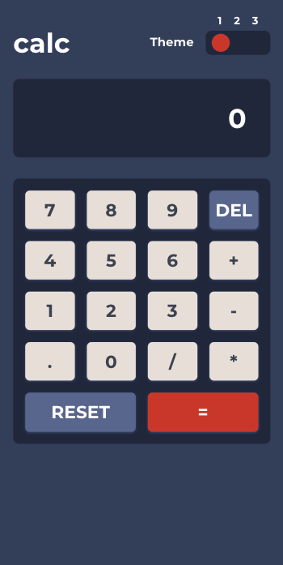
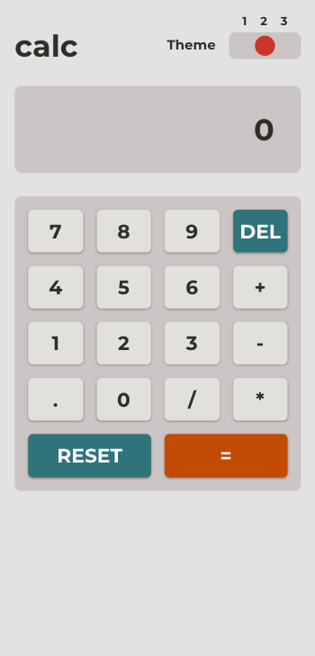
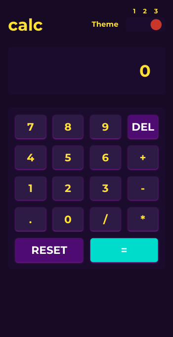
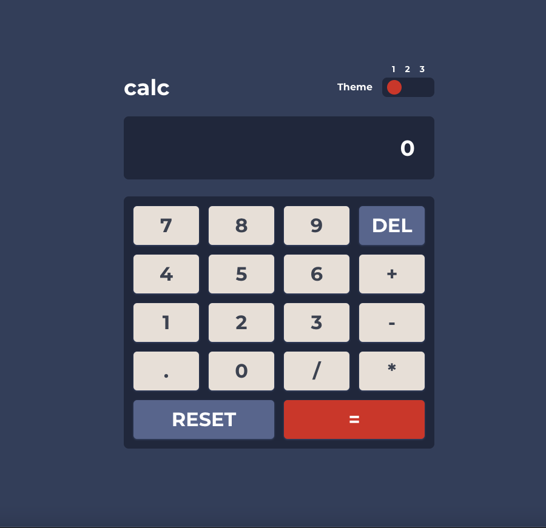

# Frontend Mentor - Calculator app solution

This is a solution to the [Calculator app challenge on Frontend Mentor](https://www.frontendmentor.io/challenges/calculator-app-9lteq5N29). Frontend Mentor challenges help you improve your coding skills by building realistic projects. 

## Table of contents

- [Overview](#overview)
  - [The challenge](#the-challenge)
  - [Screenshots](#screenshots)
  - [Links](#links)
- [My process](#my-process)
  - [Built with](#built-with)
  - [What I learned](#what-i-learned)
  - [Continued development](#continued-development)
  - [Useful resources](#useful-resources)
- [Author](#author)

## Overview

### The challenge

Users should be able to:

- See the size of the elements adjust based on their device's screen size
- Perform mathmatical operations like addition, subtraction, multiplication, and division
- Adjust the color theme based on their preference
- **Bonus**: Have their initial theme preference checked using `prefers-color-scheme` and have any additional changes saved in the browser

### Screenshots






### Links

- Live Site URL: [Click to View App](https://calc-frontend.netlify.app/)

## My process

### Built with


### What I learned

By using the **useReducer** React hook to build a calculator app, I learned how to manage complex state transitions in a predictable manner. **useReducer** provided me with a way to update state based on the previous state, similar to the traditional Redux pattern. This helped me to keep state changes predictable by dispatching actions. I defined an initial state and reducer function to manage state changes, which then allowed me to update state based on the dispatched actions. Overall, **useReducer** proved to be a useful tool in managing the state of my calculator app in a more efficient and organized way.

I also learned how to create custom color classes using the **extend** feature and how to modify the default color palette to suit my needs. With this knowledge, I was able to create three color themes that users could select from. I used a range input to allow users to switch between the three themes.

**app.jsx**
```js
const [{ currentOperand, previousOperand, operation }, dispatch] = useReducer(calcReducer, {})
```
**index.css**
```css
.theme1 {
  --bg-main: var(--bg-main1);
  --bg-keypad: var(--bg-keypad1);
  --bg-screen: var(--bg-screen1);
  --bg-delResetKeys: var(--bg-delResetKeys1);
  --bg-keys: var(--bg-keys1); 
  --keyShadow: var(--keyShadow1);
  --equalsKey: var(--equalsKey1);
  --textColor: var(--color-text1);
  --opKeyColor: var(--color-opKeys1);
}
.theme2 {
  --bg-main: var(--bg-main2);
  --bg-keypad: var(--bg-keypad2);
  --bg-screen: var(--bg-screen2);
  --bg-delResetKeys: var(--bg-delResetKeys2);
  --bg-keys: var(--bg-keys2); 
  --keyShadow: var(--keyShadow2);
  --equalsKey: var(--equalsKey2);
  --textColor: var(--color-text2);
  --opKeyColor: var(--color-opKeys2);
}
.theme3 {
  --bg-main: var(--bg-main3);
  --bg-keypad: var(--bg-keypad3);
  --bg-screen: var(--bg-screen3);
  --bg-delResetKeys: var(--bg-delResetKeys3);
  --bg-keys: var(--bg-keys3); 
  --keyShadow: var(--keyShadow3);
  --equalsKey: var(--equalsKey3);
  --textColor: var(--color-text3);
  --opKeyColor: var(--color-opKeys3);
}
```
**Tailwind Config**
```cjs
theme: {
    extend: {
      colors: {
        mainBg: 'var(--bg-main)',
        keypadBg: 'var(--bg-keypad)',
        screen: 'var(--bg-screen)',
        delResetKeys: 'var(--bg-delResetKeys)',
        keys: 'var(--bg-keys)',
        keyShadow: 'var(--keyShadow)',
        equalsKey: 'var(--equalsKey)',
        textColor: 'var(--textColor)',
        opKeyColor: 'var(--opKeyColor)'
      }
    }
}
```

### Useful resources

- [Tailwind Custom Themes](https://www.youtube.com/watch?v=TavBrPEqkbY) - This Youtube video showed me a useful method for creating custom color themes using Tailwind. By adding CSS variables to the root element for each element of the calculator UI, I was able to define background colors for 3 color schemes. I added each element of the calculator UI to my Tailwind config file which uses 1 of 3 theme classes. I utilized React's useState hook to track the current theme selected by the user. I really liked this pattern and will use it going forward.

## Author

- Website - [Adam Ascencio](https://adamdevs.vercel.app/)
- Frontend Mentor - [@adamascencio](https://www.frontendmentor.io/profile/adamascencio)
